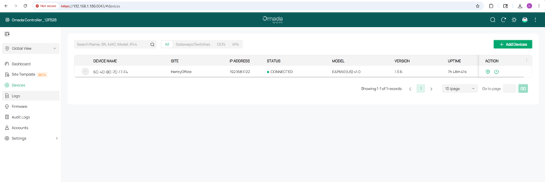

# TP-Link Omada Controller Setup for AP Management

## Objective
The goal of this lab was to set up a TP-Link Omada Controller to centrally manage my wireless access point instead of only using standalone mode.

## Lab Environment
- Controller: Omada Software Controller
- Access Point: TP-Link AX3000 AP
- Network: Home lab network
- Switches:
  - TP-Link 2.5Gb unmanaged switch
  - TP-Link 1Gb managed switch
- Router/Firewall: OPNsense / Xfinity gateway during testing

## Why I Set This Up
Before using the controller, the AP was managed directly through its web interface.  
Using the Omada Controller allows me to manage wireless settings, adoption, SSIDs, radio settings, firmware, and monitoring from one place.

## Steps Completed

### 1. Installed/Opened Omada Controller
I opened the Omada Controller and created a site for my home lab.

### 2. Reset the Access Point
The AP was reset so it could be adopted by the controller.

### 3. Adopted the AP
The controller detected the AP, and I attempted to adopt it into the site.

### 4. Configured Wireless Networks
I configured separate wireless networks for 2.4GHz and 5GHz.

Example SSIDs:
- HenryNet2G
- HenryNet5G

### 5. Verified AP Status
After adoption, I verified that the AP showed as connected/managed inside the controller.

## Issues Encountered
During setup, the AP did not adopt right away. Possible causes included:
- AP was still tied to standalone mode
- Wrong device credentials
- Controller URL/IP mismatch
- AP needed to be reset again
- Local controller account and cloud account were different

## Troubleshooting Performed
- Reset the AP
- Checked the AP IP address
- Checked controller access
- Verified local and cloud login differences
- Reviewed 2.4GHz and 5GHz wireless settings
- Confirmed whether the controller combined or separated Wi-Fi bands

## What I Learned
This lab helped me understand how wireless AP controllers work. I learned that an AP can be managed in standalone mode or controller mode, but adoption requires the controller to take ownership of the device. I also learned how controller-managed Wi-Fi settings can affect SSIDs, radio bands, and how devices appear connected.

## Proof of Completion
The screenshots in this repository show the controller setup, AP adoption process, wireless configuration, and final AP status.
