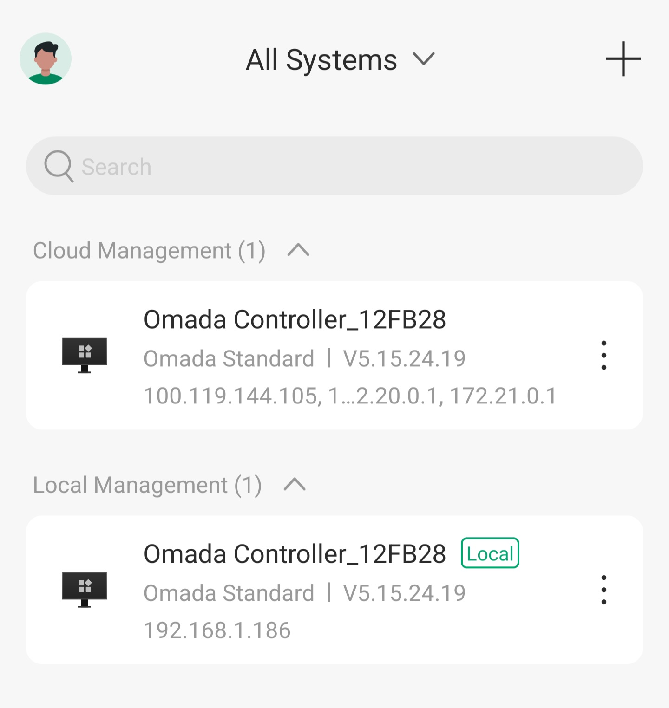
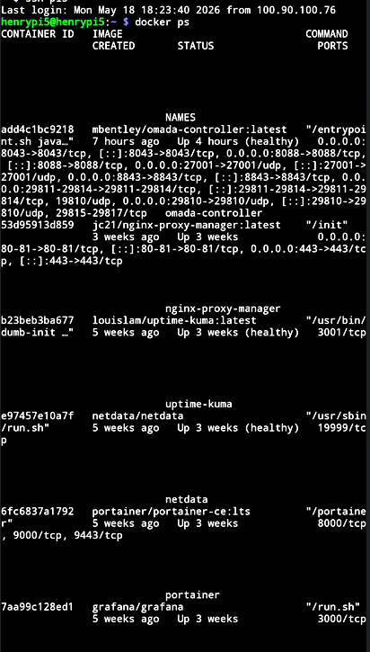
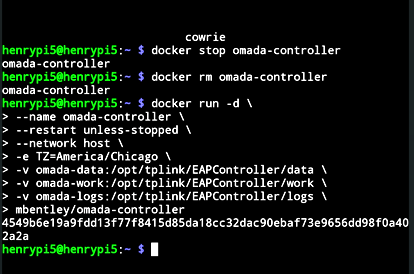
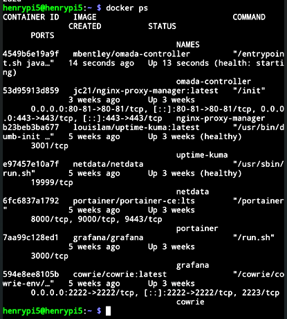
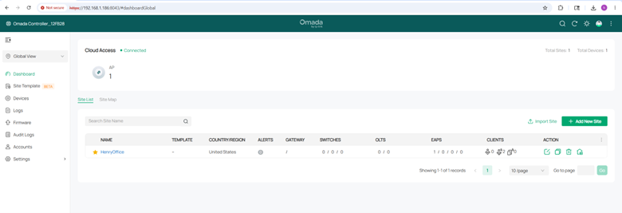
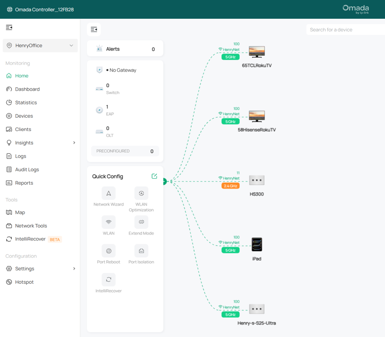

# TP-Link Omada Controller Lab — Self-Hosted AP Management on Raspberry Pi 5

## Objective

Deploy a self-hosted TP-Link Omada Software Controller in Docker on a Raspberry Pi 5 to centrally manage a TP-Link EAP650 access point, replacing standalone mode with full controller-managed operation.

---

## Lab Environment

| Component | Details |
|-----------|---------|
| Controller Host | Raspberry Pi 5 (Proxmox, Docker via LXC) |
| Access Point | TP-Link EAP650 (AX3000) |
| Controller Software | Omada Software Controller v5.15.24 |
| Docker Image | `mbentley/omada-controller:latest` |
| Network | Home lab — OPNsense firewall, LAN `192.168.1.0/24` |
| Switches | TP-Link 2.5Gb unmanaged, TP-Link 1Gb managed |

---

## Why Controller Mode vs Standalone

Before this lab, the EAP650 was managed through its own web interface. That works fine for a single AP but you lose centralized visibility, roaming configuration, and the ability to push consistent SSIDs and radio settings across multiple devices.

The Omada Controller adds:
- Unified dashboard for all managed devices
- Site-level SSID and radio configuration
- Client tracking and network topology view
- Firmware management from one place
- Cloud access (optional) for remote management

---

## Steps

### 1. Initial Docker Deployment (Bridge Mode)

The controller was initially launched in standard bridge networking mode. It came up healthy and was accessible via the web UI at `https://192.168.1.186:8043`.

```bash
docker run -d \
  --name omada-controller \
  --restart unless-stopped \
  -e TZ=America/Chicago \
  -v omada-data:/opt/tplink/EAPController/data \
  -v omada-work:/opt/tplink/EAPController/work \
  -v omada-logs:/opt/tplink/EAPController/logs \
  mbentley/omada-controller
```



At this point the controller was running alongside other containers: nginx-proxy-manager, uptime-kuma, netdata, portainer, grafana, and cowrie.



---

### 2. AP Discovery Problem — Bridge Networking Limitation

After logging into the controller and setting up a site, the EAP650 was not being discovered. The controller uses **multicast and broadcast** to find APs on the local network. In bridge mode, Docker NATting blocks this traffic — the controller can't see devices outside the container network.

**Fix: Switch to host networking.**

The container was stopped, removed, and relaunched with `--network host`:

```bash
docker stop omada-controller
docker rm omada-controller

docker run -d \
  --name omada-controller \
  --restart unless-stopped \
  --network host \
  -e TZ=America/Chicago \
  -v omada-data:/opt/tplink/EAPController/data \
  -v omada-work:/opt/tplink/EAPController/work \
  -v omada-logs:/opt/tplink/EAPController/logs \
  mbentley/omada-controller
```



With host networking, the controller binds directly to the Pi's network interface and can send/receive the multicast traffic needed for AP discovery.



---

### 3. Controller Setup and Cloud Link

Once running in host mode, the controller came back up and was linked to TP-Link's cloud for optional remote access. The cloud account allows managing the controller through the Omada app or portal without needing to be on the local network.

The controller showed up under **Cloud Management** in the portal as `Omada Controller_12FB28` running Omada Standard v5.15.24. It also appears under **Local Management** accessible directly at `192.168.1.186`.


### 4. AP Adoption

With host networking active, the EAP650 appeared in the controller's device list. It was adopted into the `HenryOffice` site and came up as **Connected**.


Device details visible in the controller:
- MAC: `BC-60-BC-7C-17-F4`
- IP: `192.168.1.122`
- Model: EAP650
- Status: Connected
- Uptime: stable

---

### 5. Global Dashboard

The global view shows the full site summary including device counts, client counts, and alert status across all managed sites.



---

### 6. Network Topology

The topology view maps the EAP650 and its connected clients. Five clients visible: `65TCLRokuTV`, `58HisenseRokuTV`, `HS300`, `iPad`, and `Henry-s-S25-Ultra`. Most are on 5GHz; the HS300 smart plug is on 2.4GHz. The AP is shown without a gateway since OPNsense handles routing separately and was not adopted into Omada.



---

## Issues Encountered

**AP not discovered in bridge mode**
The controller running in Docker bridge mode cannot reach the LAN broadcast/multicast traffic needed to discover APs. Switching to `--network host` resolved this. This is a known limitation of running Omada in Docker and is documented in the `mbentley/omada-controller` image README.

**AP adoption initial failure**
After switching to host mode, the AP still didn't adopt immediately. The AP needed a factory reset to clear any residual standalone-mode state before the controller could take ownership.

**URL mismatch after container recreation**
After recreating the container, the controller URL changed (port binding behavior differs slightly between bridge and host mode). Had to update the URL in the Omada cloud portal to match.

---

## What I Learned

Running Omada in Docker requires host networking if you want AP discovery to work — bridge mode silently breaks multicast. This same issue would apply to any controller software that relies on L2 broadcast discovery (UniFi has the same constraint).

The distinction between **standalone mode** and **controller mode** is meaningful: the AP behaves differently under controller management, and switching requires a reset. You can't just point a standalone-configured AP at a controller and expect it to work cleanly.

Controller-managed SSIDs override anything configured directly on the AP, which is the right behavior for a managed environment but surprising if you're used to standalone mode.

---

## Repository Structure

├── screenshots/
│   ├── 01-docker-omada-controller.png
│   ├── 02-docker-containers-before-host-mode.png
│   ├── 03-docker-containers-after-host-mode.png
│   ├── 04-global-dashboard.png
│   ├── 05-ap-connected.png
│   ├── 06-network-topology.png
│   └── 07-host-network-run-command.png
